# GOLEM-3DMCP

> *"Shaped from clay, brought to life by words"*

**The most powerful MCP server for Rhinoceros 3D — 105 tools giving Claude full read/write access to Rhino 8.**

[](LICENSE)
[](https://www.rhino3d.com/)
[](https://python.org)
[](https://modelcontextprotocol.io/)

---

GOLEM-3DMCP implements the [Model Context Protocol](https://modelcontextprotocol.io/) to give Claude Code direct, programmatic control of Rhino 8 — create geometry, run booleans, drive Grasshopper, capture viewports, and execute arbitrary Python scripts, all through natural language.

---

## Demo — City Built Entirely by Claude

> An entire city generated in Rhino 8 through GOLEM-3DMCP — roads, skyscrapers, houses, trees, people, vehicles, a stadium, bridge, ferris wheel, harbor, wind turbines, and a floating GOLEM hologram. All created by Claude Code using natural language commands.

[](https://youtu.be/GoWN9vGlWCs)
<p align="center"><strong>Watch the full demo video on YouTube</strong></p>

<p align="center">
  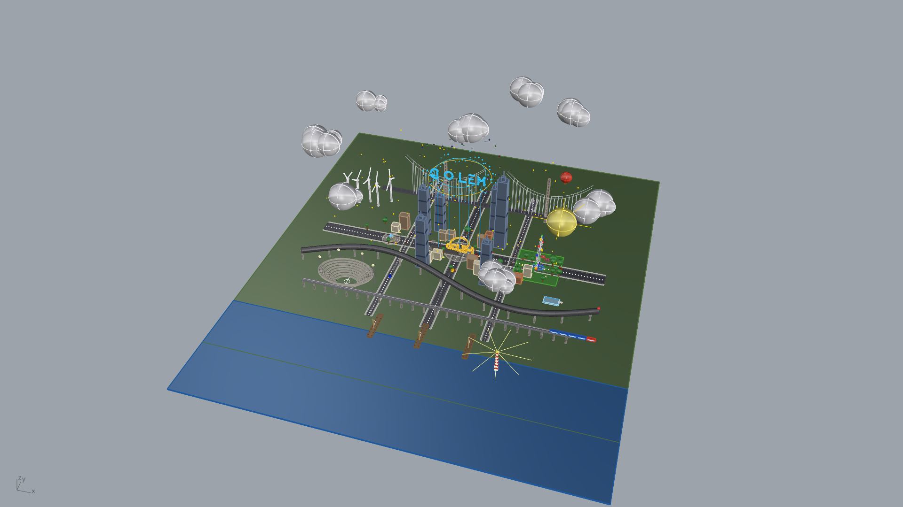
</p>
<p align="center"><em>Full city overview — ground, roads, buildings, park, harbor, sky</em></p>

<p align="center">
  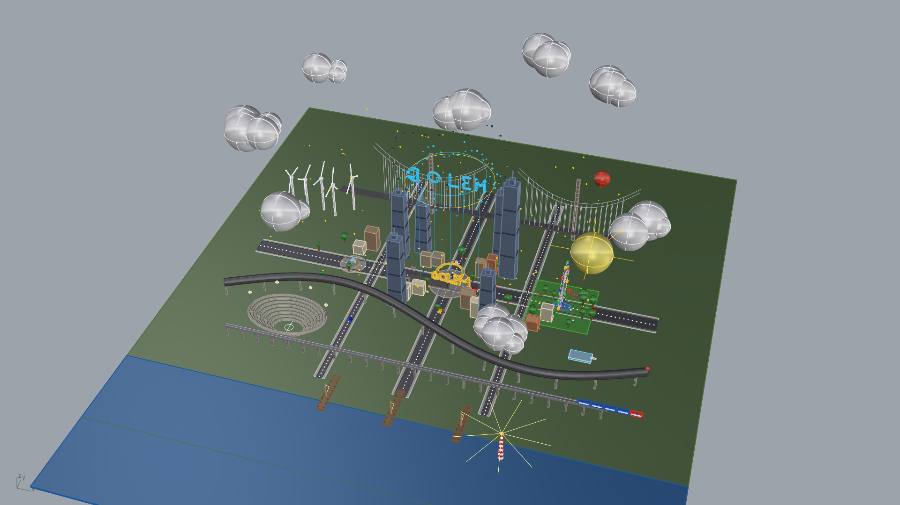
</p>
<p align="center"><em>Skyline view — skyscrapers, bridge, wind turbines, floating GOLEM hologram</em></p>

<p align="center">
  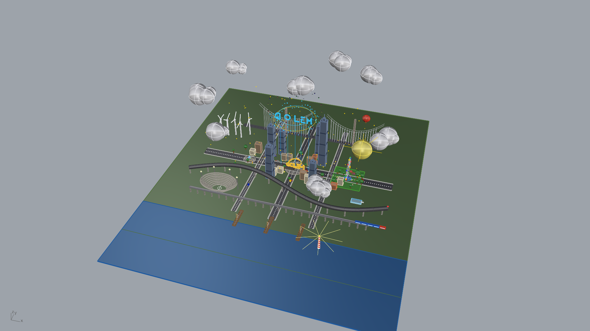
</p>
<p align="center"><em>Close-up — GOLEM monument plaza, residential buildings, fountain</em></p>

<p align="center">
  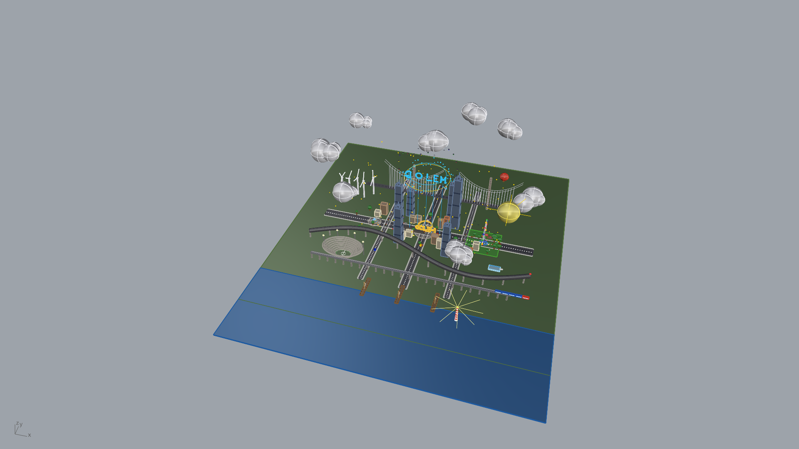
</p>
<p align="center"><em>Street level — vehicles, people, street lamps, stadium, harbor with boats</em></p>

---

## Architecture

```
 Claude Code
      |
      |  MCP (stdio, JSON-RPC)
      v
+---------------------------+
|     MCP Server            |
|     Python 3.10+          |
|     FastMCP + 9 tool      |
|     modules               |
+---------------------------+
      |
      |  TCP 127.0.0.1:9876
      |  Length-prefixed JSON
      v
+---------------------------+
|     Rhino Plugin          |
|     Python 3.9 (embedded) |
|     TCP Server            |
|     Dispatcher            |
|     9 handler modules     |
+---------------------------+
      |
      |  RhinoCommon + rhinoscriptsyntax
      v
+---------------------------+       +-------------------------+
|     Rhinoceros 3D         | <---> |   Grasshopper           |
|     UI Thread             |       |   Sub-server :9877      |
|     Document, Geometry,   |       |   Definitions, Params,  |
|     Layers, Views         |       |   Components, Bake      |
+---------------------------+       +-------------------------+
```

---

## 105 Tools Across 9 Categories

| Category | Tools | Highlights |
|----------|:-----:|------------|
| **Scene Intelligence** | 10 | Document info, layers, objects, groups, blocks — no object cap, full pagination |
| **Geometry Creation** | 38 | Points, curves, NURBS, solids, mesh, SubD, text, dimensions, hatches |
| **Geometry Operations** | 19 | Boolean union/difference/intersection, trim, split, offset, fillet, chamfer, intersect, mesh from NURBS |
| **Surface Operations** | 12 | Loft, sweep1/2, revolve, extrude, network surface, patch, edge surface, unroll |
| **Object Manipulation** | 21 | Move, copy, rotate, scale, mirror, array (linear/polar/along curve), join, explode, group, properties |
| **Grasshopper** | 9 | Open definitions, set/get parameters, recompute, bake, inspect component graph |
| **Viewport & Visualization** | 13 | Capture screenshots (base64 PNG), camera control, named views, display modes |
| **File Operations** | 9 | Save, open, import, export (STL, OBJ, STEP, IGES, FBX, 3MF, DWG, PDF, and more) |
| **Script Execution** | 4 | Execute arbitrary Python with full RhinoCommon access, run Rhino commands, evaluate expressions |

See [docs/TOOL_REFERENCE.md](docs/TOOL_REFERENCE.md) for the complete reference with parameters and examples.

---

## Quick Start

### 1. Clone and set up

```bash
git clone git@github.com:TheKingHippopotamus/GOLEM-3DMCP-Rhino-.git
cd GOLEM-3DMCP-Rhino-
bash setup.sh
```

### 2. Load the plugin into Rhino

Open Rhino 8, then open the Script Editor (`Tools > Python Script > Edit`).
Open `rhino_plugin/startup.py` and click **Run**.

```
GOLEM-3DMCP: Starting server on 127.0.0.1:9876...
GOLEM-3DMCP: Server started successfully!
GOLEM-3DMCP: 135 handler methods registered.
```

For auto-start on every Rhino launch: `Tools > Options > RhinoScript > Startup Scripts > Add startup.py`

### 3. Register with Claude Code

```bash
claude mcp add --config .mcp.json
```

### 4. Start modeling with Claude

Open Claude Code and try:

> *"Create a 200 x 100 x 50 box at the origin, then create a sphere of radius 30 centred at [100, 50, 50]. Boolean-union the two objects."*

---

## Requirements

| Requirement | Version |
|-------------|---------|
| Rhinoceros 3D | 8.x (macOS) |
| Python | 3.10+ (for MCP server) |
| macOS | 12 Monterey or newer |

The Rhino plugin runs inside Rhino's embedded Python 3.9 with zero external dependencies.

---

## Installation

### Automated

```bash
bash setup.sh
```

This will:
1. Find Python 3.10+ (pyenv, homebrew, or system)
2. Create `.venv` and install dependencies
3. Optionally install the Rhino startup script
4. Optionally configure Claude Code MCP settings

### Manual

```bash
python3.12 -m venv .venv
.venv/bin/pip install -e ".[dev]"
```

| Dependency | Purpose |
|------------|---------|
| `mcp[cli]>=1.0.0` | MCP server framework (FastMCP) |
| `pydantic>=2.0.0` | Data validation and models |
| `httpx>=0.24.0` | Async HTTP (MCP internals) |

### Loading the Rhino Plugin

**Option A — Manual (each session):**
Open Rhino > Script Editor > Open `startup.py` > Run

**Option B — Auto-start (recommended):**
`Tools > Options > RhinoScript > Startup Scripts > Add startup.py`

**Option C — rhinocode CLI:**
```bash
export PATH="/Applications/Rhino 8.app/Contents/Resources/bin:$PATH"
python scripts/start_rhino_server.py
```

### Verify Connection

```bash
.venv/bin/python scripts/test_connection.py
```

---

## Configuration

| Variable | Default | Description |
|----------|---------|-------------|
| `GOLEM_RHINO_HOST` | `127.0.0.1` | Rhino plugin host |
| `GOLEM_RHINO_PORT` | `9876` | Rhino plugin TCP port |
| `GOLEM_GH_PORT` | `9877` | Grasshopper sub-server port |
| `GOLEM_TIMEOUT` | `30` | Command timeout (seconds) |
| `GOLEM_HEAVY_TIMEOUT` | `120` | Heavy operation timeout (seconds) |

---

## Example Usage

### Create and combine geometry
```
Create a 100 x 50 x 30 box on a layer called 'Structure',
then boolean-union it with a sphere of radius 20 centred at [50, 25, 30].
```

### Query the scene
```
List all objects on the 'Walls' layer and tell me their volumes.
```

### Drive Grasshopper
```
Open parametric_facade.gh, set the 'PanelCount' slider to 24,
recompute, and bake the result to a 'Facade' layer.
```

### Capture a viewport
```
Set perspective view to shaded mode, zoom to extents, and capture a screenshot.
```

### Execute arbitrary Python
```python
# Claude runs this inside Rhino via execute_python:
import Rhino.Geometry as rg
pts = [rg.Point3d(i*10, 0, i**2) for i in range(20)]
crv = rg.Curve.CreateInterpolatedCurve(pts, 3)
sc.doc.Objects.AddCurve(crv)
__result__ = {"point_count": len(pts), "length": crv.GetLength()}
```

---

## Project Structure

```
GOLEM-3DMCP/
├── mcp_server/                 # Part B: MCP Server (Python 3.10+)
│   ├── server.py               #   FastMCP entry point
│   ├── connection.py           #   TCP client (singleton, thread-safe, auto-reconnect)
│   ├── protocol.py             #   Wire format: 4-byte length prefix + JSON
│   ├── config.py               #   Environment variable configuration
│   ├── models/                 #   Pydantic data models
│   └── tools/                  #   9 MCP tool modules
│
├── rhino_plugin/               # Part A: Rhino Plugin (Python 3.9)
│   ├── server.py               #   TCP server (runs inside Rhino)
│   ├── startup.py              #   Bootstrap: start/stop/restart
│   ├── dispatcher.py           #   Handler registry + routing
│   ├── protocol.py             #   Wire format (byte-compatible)
│   ├── handlers/               #   9 handler modules (the actual Rhino code)
│   │   ├── scene.py            #     Scene intelligence
│   │   ├── creation.py         #     Geometry creation
│   │   ├── operations.py       #     Booleans, offset, fillet, intersect
│   │   ├── surfaces.py         #     Loft, sweep, revolve, extrude
│   │   ├── manipulation.py     #     Transform, copy, group, properties
│   │   ├── grasshopper.py      #     GH definition control
│   │   ├── viewport.py         #     View capture and camera
│   │   ├── files.py            #     File I/O and export
│   │   └── scripting.py        #     Arbitrary code execution
│   ├── grasshopper/            #   GH sub-server and utilities
│   └── utils/                  #   Serializers, GUID registry, error handler
│
├── scripts/                    # Setup and utility scripts
│   ├── install_plugin.py       #   Auto-install Rhino startup script
│   ├── start_rhino_server.py   #   Start via rhinocode CLI
│   ├── test_connection.py      #   Connection diagnostics
│   └── configure_claude.py     #   Configure Claude Code MCP settings
│
├── tests/                      # 226 tests (pytest)
├── docs/                       # Architecture, protocol spec, tool reference
├── setup.sh                    # One-command setup
├── pyproject.toml              # Package definition
└── .mcp.json                   # Claude Code MCP configuration
```

---

## Documentation

- [Architecture](docs/ARCHITECTURE.md) — System design, threading model, data flow
- [Tool Reference](docs/TOOL_REFERENCE.md) — All 105 tools with parameters and examples
- [Protocol Specification](docs/PROTOCOL.md) — TCP wire format, message framing, error codes
- [Troubleshooting](docs/TROUBLESHOOTING.md) — Common issues and solutions

---

## Testing

```bash
# Unit tests (no Rhino needed)
.venv/bin/python -m pytest tests/ -v --ignore=tests/test_integration.py

# Full suite (integration tests auto-skip if Rhino not running)
.venv/bin/python -m pytest tests/ -v

# Integration tests only (requires Rhino + plugin running)
.venv/bin/python -m pytest tests/test_integration.py -v -m integration
```

---

## Troubleshooting

| Problem | Quick Fix |
|---------|-----------|
| Connection refused | Start Rhino + run `startup.py` |
| Port already in use | `lsof -i :9876` then kill the process |
| MCP server not in Claude | Run `python scripts/configure_claude.py` |
| Grasshopper tools fail | Open Grasshopper in Rhino first |
| Python version error | Need Python 3.10+ for MCP server |

See [docs/TROUBLESHOOTING.md](docs/TROUBLESHOOTING.md) for detailed solutions.

---

## License

MIT License. See [LICENSE](LICENSE) for details.

---

## Credits

<p align="center">
  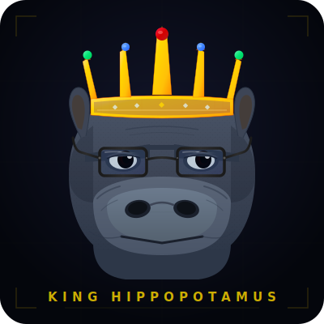
</p>

<p align="center">
  Created by <strong>King Hippopotamus</strong><br/>
  Built by <strong>NEXUS AI</strong> — 30 parallel agents across 3 phases
</p>

### The NEXUS Team That Built GOLEM

<p align="center">
  
  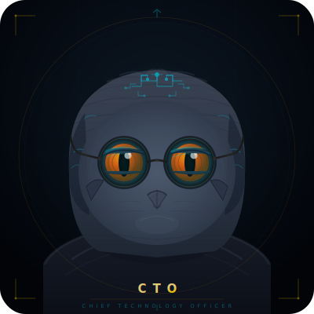
  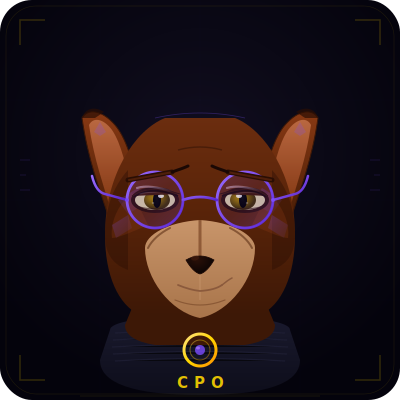
  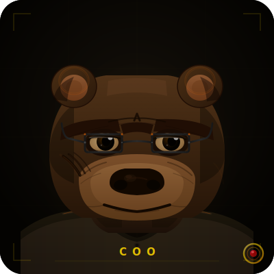
  
  
</p>
<p align="center">
  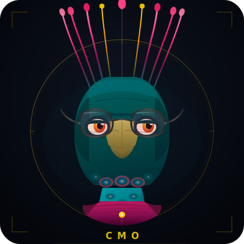
  
  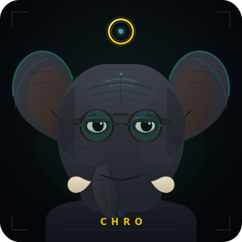
  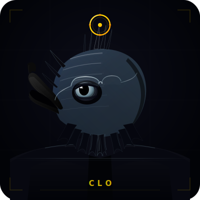
  
</p>


<p align="center"><em>195 autonomous agents | 20 departments | 11 tiers</em></p>

---

**GOLEM-3DMCP** uses:
- [FastMCP](https://github.com/jlowin/fastmcp) — MCP server framework
- [RhinoCommon](https://developer.rhino3d.com/api/rhinocommon/) — Rhino geometry API
- [rhinoscriptsyntax](https://developer.rhino3d.com/api/RhinoScriptSyntax/) — Python scripting for Rhino
- [Grasshopper SDK](https://developer.rhino3d.com/api/grasshopper/) — Parametric design control

---

*"From formless clay, through the power of words, form emerges."*
